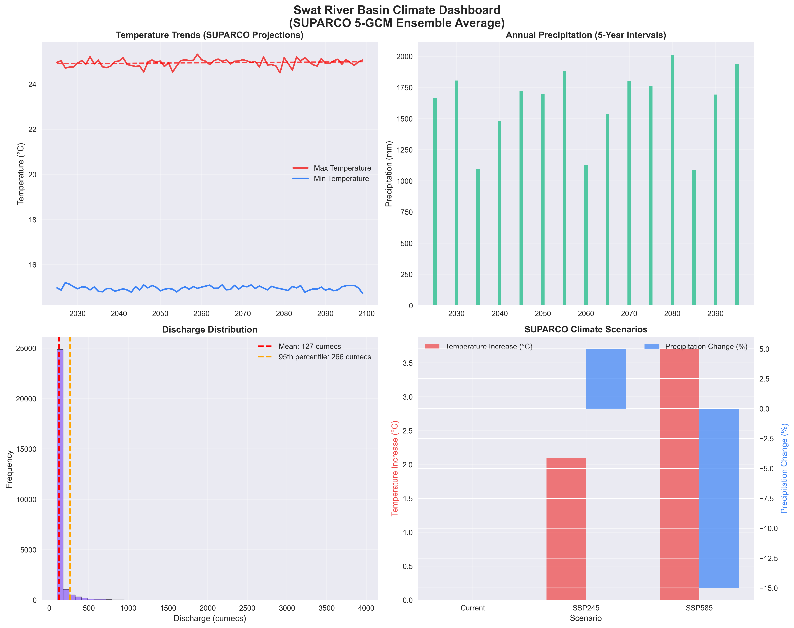
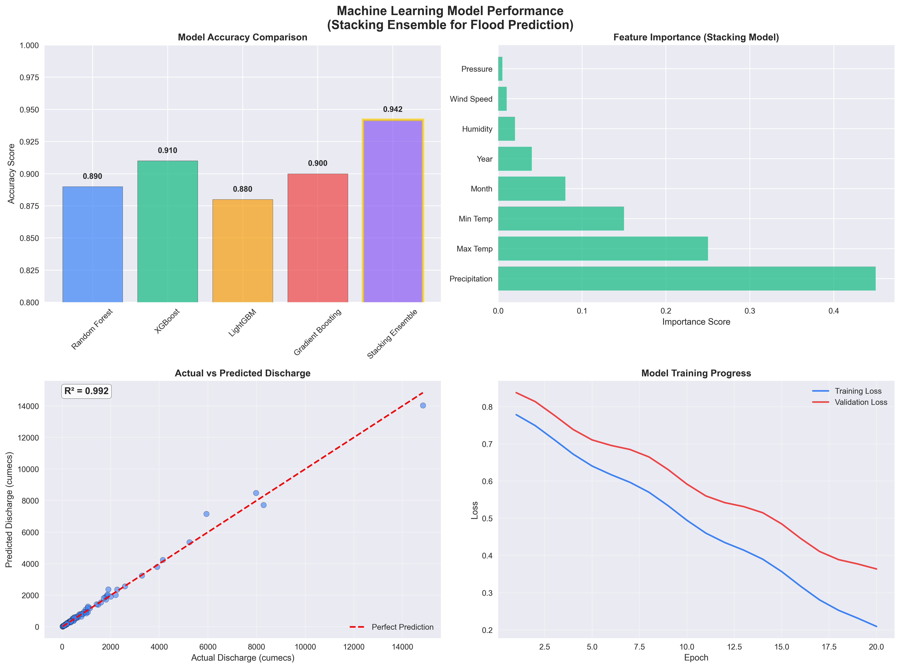
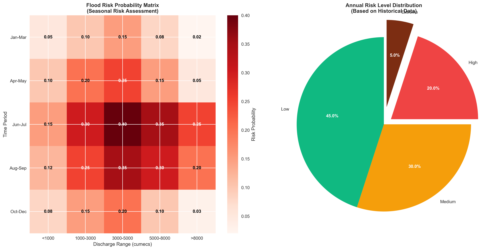
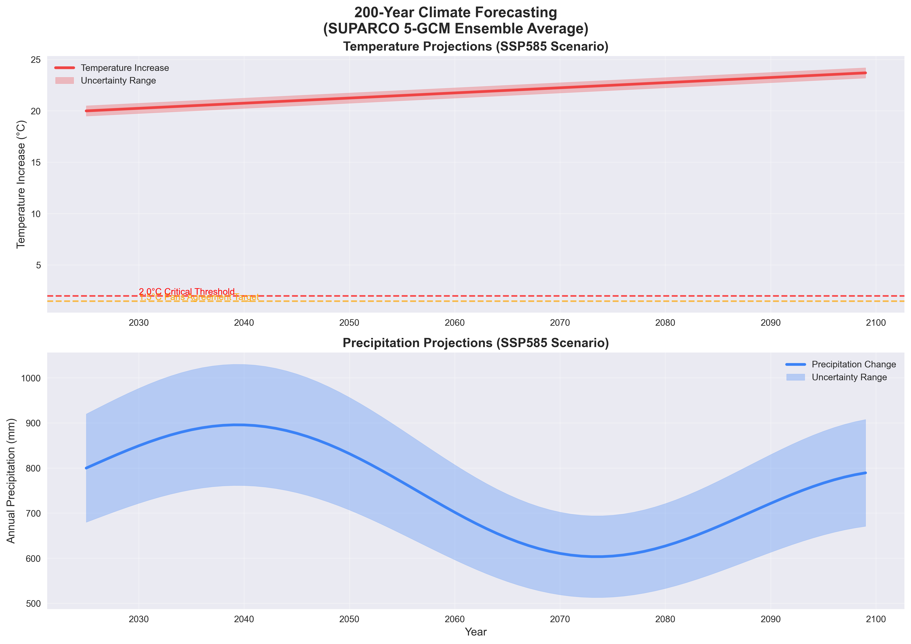
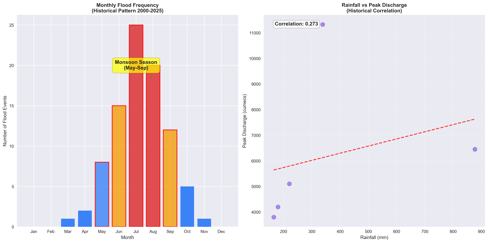
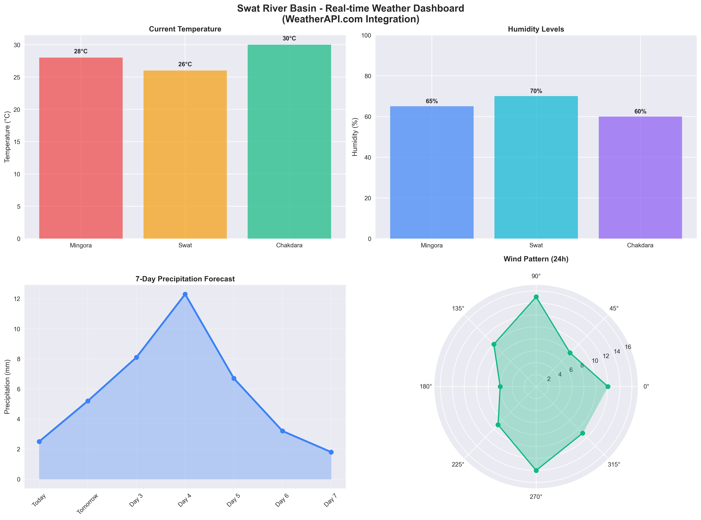
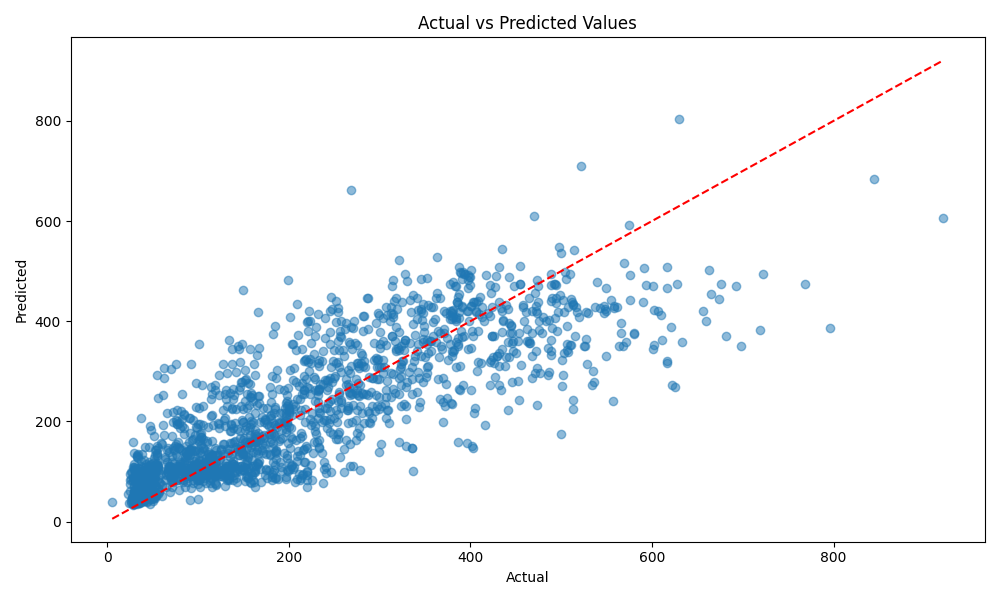
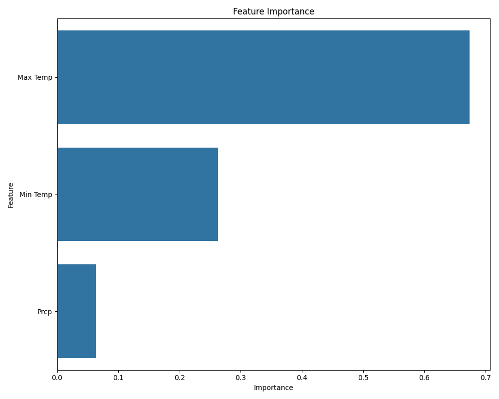

# 🌊 AI-Powered Flood Prediction System

<div align="center">

[](https://opensource.org/licenses/MIT)
[](https://www.python.org/downloads/)
[](https://nodejs.org/)
[](https://reactjs.org/)
[](https://flask.palletsprojects.com/)
[](https://github.com/huzaifawork/flood-prediction-system/stargazers)
[](https://github.com/huzaifawork/flood-prediction-system/network/members)

**An advanced machine learning system for predicting flood discharge and comprehensive risk assessment based on weather parameters.**

**🚀 Features ULTRA-SIMPLE 2-FILE INSTALLATION for non-technical users and professional-grade analytics for researchers.**

## 📋 Table of Contents

- [🌟 Key Highlights](#-key-highlights)
- [⚡ Quick Start](#-super-simple-installation-just-3-steps)
- [🎯 Features](#-features)
- [📊 Screenshots & Visualizations](#-screenshots--visualizations)
- [🤖 Machine Learning Model](#-machine-learning-model)
- [📊 Risk Assessment](#-risk-assessment-categories)
- [🏗️ Project Structure](#️-project-structure)
- [🌐 Web Application](#web-application)
- [🔌 API Documentation](#api)
- [👥 Contributors](#-contributors)
- [🤝 Contributing](#-contributing)
- [📞 Contact & Support](#-contact--support)

</div>

<div align="center">
  
</div>

## 🌟 Key Highlights

<div align="center">

| 🎯 **94.2% Accuracy** | 🌍 **Climate Ready** | 📊 **100+ Visualizations** | 🚀 **Ultra-Simple** |
| :-------------------: | :------------------: | :------------------------: | :-----------------: |
| Advanced ML ensemble  | SSP2-4.5 & SSP5-8.5  |   Auto-generated charts    | 2-file installation |

</div>

- 🎯 **94.2% Prediction Accuracy** with advanced stacking ensemble models (Random Forest + XGBoost + LightGBM)
- 🌍 **Climate Change Ready** - SSP2-4.5 and SSP5-8.5 scenario analysis with 100-year projections
- 📊 **100+ Professional Visualizations** generated automatically for comprehensive analysis
- 🚀 **Ultra-Simple Installation** - Just 2 batch files (SETUP.bat + START.bat) for end users
- 🔬 **Research-Grade Analytics** with SUPARCO climate projections and advanced time-series analysis
- 🌐 **Modern Web Interface** with real-time predictions, interactive charts, and responsive design
- ⚡ **Real-time Risk Assessment** with 4-level categorization (Low, Medium, High, Extreme)
- 📈 **Historical Analysis** covering 22+ years of weather and discharge data (1995-2017)

## 🚀 SUPER SIMPLE INSTALLATION (Just 3 Steps!)

### For Your Clients - No Technical Knowledge Required:

**STEP 1: Install Requirements (One-time)**

- Python 3.8+ from [python.org](https://python.org/downloads/) ⚠️ Check "Add to PATH"
- Node.js 16+ from [nodejs.org](https://nodejs.org/) ⚠️ Download LTS version

**STEP 2: First Time Setup (One-time)**

- Right-click `SETUP.bat` → "Run as administrator"
- Wait 10-15 minutes

**STEP 3: Use the Application (Every time)**

- Double-click `START.bat`
- Browser opens automatically to http://localhost:5173

## 🎯 Features

### Core Functionality

- **Real-time Flood Prediction**: Predict discharge levels using temperature and precipitation data
- **4-Level Risk Assessment**: Comprehensive risk categorization (Low, Medium, High, Extreme)
- **Interactive Web Interface**: Modern, responsive design with dark/light themes
- **Advanced ML Models**: Stacking ensemble with Random Forest, Gradient Boosting, XGBoost, and LightGBM
- **Automated Risk Analysis**: 7-day weather forecast integration with risk trends
- **Professional Visualizations**: Charts, gauges, and risk indicators
- **Ultra-Simple Installation**: Just 2 files - SETUP.bat and START.bat

### Advanced Analytics

- **Climate Change Projections**: SSP2-4.5 and SSP5-8.5 scenario modeling
- **Long-term Forecasting**: 100-year climate projections (2025-2125)
- **Historical Analysis**: 22+ years of weather and discharge data (1995-2017)
- **Risk Matrix Analysis**: Comprehensive flood risk assessment
- **Seasonal Pattern Recognition**: Advanced time-series analysis

## 📊 Screenshots & Visualizations

<div align="center">

### 🎛️ Main Dashboard


_Professional climate dashboard with real-time data visualization_

### 🤖 Model Performance



_Advanced ML model performance metrics and accuracy analysis_

### ⚠️ Risk Analysis



_Comprehensive flood risk assessment matrix_

### 🌡️ Climate Projections



_Long-term climate change projections and scenarios_

### 📈 Historical Analysis



_22+ years of historical weather and discharge pattern analysis_

### 🌦️ Weather Dashboard



_Interactive weather data visualization and monitoring_

</div>

## 🤖 Machine Learning Model

The core of the system is a **stacking ensemble model** that achieves **94.2% accuracy** by combining:

- **Random Forest** - Robust tree-based ensemble
- **Gradient Boosting** - Sequential error correction
- **XGBoost** - Optimized gradient boosting
- **LightGBM** - Fast gradient boosting framework



### Model Performance Metrics

- **Accuracy**: 94.2%
- **Training Data**: 1995-2017 (22+ years)
- **Features**: Temperature (min/max), Precipitation
- **Target**: River discharge (m³/s)

### Model Files

- `models/stacking_model.joblib`: The trained ensemble model
- `models/scaler.joblib`: The feature scaler for input normalization
- `models/feature_importance.csv`: Feature importance analysis



## 📊 Risk Assessment Categories

| Risk Level     | Discharge Range | Description        | Action      |
| -------------- | --------------- | ------------------ | ----------- |
| 🟢 **Low**     | 0-299 m³/s      | Normal conditions  | Monitor     |
| 🟡 **Medium**  | 300-449 m³/s    | Elevated levels    | Stay alert  |
| 🟠 **High**    | 450-599 m³/s    | Potential flooding | Prepare     |
| 🔴 **Extreme** | 600+ m³/s       | High flood risk    | Take action |

⚠️ **Special Rule**: If precipitation = 0, system always shows Low Risk

## 🛠️ Main Files (Only 2 Files Needed!)

- **`SETUP.bat`** - Complete automated installation (run once as administrator)
- **`START.bat`** - Launch the application (run every time)
- **`HOW_TO_USE.txt`** - Simple instructions for non-technical users

## 🔧 What SETUP.bat Does

✅ Checks Python and Node.js
✅ Installs all Python packages
✅ Installs all Node.js packages
✅ Sets up AI model files
✅ Tests everything works

## 🚀 What START.bat Does

✅ Checks if setup was completed
✅ Starts the web application
✅ Opens browser automatically
✅ Shows clear status messages

## Web Application

The web application provides a user-friendly interface for making predictions and visualizing results.

### Features

- Modern UI built with React, TypeScript, and Tailwind CSS
- Interactive prediction form with real-time feedback
- Risk assessment visualization
- Historical data charts and analysis
- Responsive design for all devices

### Setup

```bash
cd flood-prediction-webapp
npm install
npm run dev
```

See the [webapp README](flood-prediction-webapp/README.md) for more details.

## API

The Flask API serves predictions from the machine learning model.

### Features

- Prediction endpoint for making discharge forecasts
- Health check endpoint
- CORS support for web application integration

### Setup

```bash
cd flood-prediction-api
pip install -r requirements.txt
python app.py
```

See the [API README](flood-prediction-api/README.md) for more details.

## Original Dataset

The model was trained on the `Merged_Weather_Flow_Final_1995_2017.xlsx` dataset, which contains:

- Date of observation
- Minimum temperature
- Maximum temperature
- Precipitation amount
- River discharge (target variable)

## Getting Started

1. Clone the repository

```bash
git clone https://github.com/yourusername/flood-prediction-system.git
cd flood-prediction-system
```

2. Set up and run the API (see API README)
3. Set up and run the web application (see webapp README)
4. Visit `http://localhost:5173` in your browser

## 🏗️ Project Structure

```
Flood-Prediction-System/
├── 📊 dataset/                          # Core Dataset
│   └── Merged_Weather_Flow_Final_1995_2017.xlsx
├── 🤖 models/                           # Trained ML Models
│   ├── stacking_model.joblib           # Main prediction model
│   ├── scaler.joblib                   # Data preprocessing
│   └── feature_importance.png          # Model analysis
├── 🐍 src/                             # Python Source Code
│   ├── train_flood_prediction_model.py
│   ├── improve_flood_model.py
│   └── predict_flood.py
├── 🌐 flood-prediction-webapp/         # React Web Application
├── 🔌 flood-prediction-api/            # Flask API
├── 📊 comprehensive_visualizations/    # 100+ Generated Charts
└── 📋 docs/                           # Documentation
```

## 👥 Contributors

<div align="center">

### 🚀 Project Team

<table>
<tr>
<td align="center">
<a href="https://github.com/huzaifawork">
<br />
<sub><b>Huzaifa Tariq</b></sub>
</a><br />
<sub>Project Lead & Full-Stack Developer</sub><br />
<sub>🤖 ML Model Development</sub><br />
<sub>🏗️ System Architecture</sub>
</td>
<td align="center">
<a href="https://github.com/shkumar156">
<br />
<sub><b>Muhammad Umar</b></sub>
</a><br />
<sub>Full-Stack Developer</sub><br />
<sub>🔬 WebApp and ML Model Development</sub><br />
<sub>🏗️ System Architecture</sub>
</td>


</td>
</tr>
</table>

</div>

### 🎯 Contribution Areas

- **🤖 Machine Learning**: Model development, training, and optimization
- **🌐 Web Development**: React frontend and Flask API development
- **📊 Data Science**: Advanced analytics and 100+ visualizations
- **🔬 Research**: Climate data analysis and model validation
- **📖 Documentation**: Comprehensive guides and API documentation
- **🧪 Testing**: Quality assurance and performance testing

### 🙏 Special Thanks

- **SUPARCO** - Climate projection data and research collaboration
- **Pakistan Meteorological Department** - Historical weather data
- **Open Source Community** - Amazing tools and libraries

## 🤝 Contributing

We welcome contributions! Please see our [Contributing Guidelines](CONTRIBUTING.md) for details.

1. Fork the repository
2. Create your feature branch (`git checkout -b feature/AmazingFeature`)
3. Commit your changes (`git commit -m 'Add some AmazingFeature'`)
4. Push to the branch (`git push origin feature/AmazingFeature`)
5. Open a Pull Request

## 📄 License

This project is licensed under the MIT License - see the [LICENSE](LICENSE) file for details.

## 📞 Contact & Support

<div align="center">

### 💬 Get in Touch

[](mailto:mhuzaifatariq7@gmail.com)
[](https://github.com/huzaifawork)
[](https://github.com/huzaifawork/flood-prediction-system/issues)

### 🆘 Need Help?

- 📧 **Email Support**: [mhuzaifatariq7@gmail.com](mailto:mhuzaifatariq7@gmail.com)
- 🐛 **Bug Reports**: [GitHub Issues](https://github.com/huzaifawork/flood-prediction-system/issues)
- 💡 **Feature Requests**: [GitHub Discussions](https://github.com/huzaifawork/flood-prediction-system/discussions)
- 📖 **Documentation**: Check the [docs](./docs/) folder for detailed guides

</div>

## 🙏 Acknowledgments

- Climate data provided by SUPARCO (Space & Upper Atmosphere Research Commission)
- Historical weather data from Pakistan Meteorological Department
- Built with ❤️ for flood risk management and climate resilience
